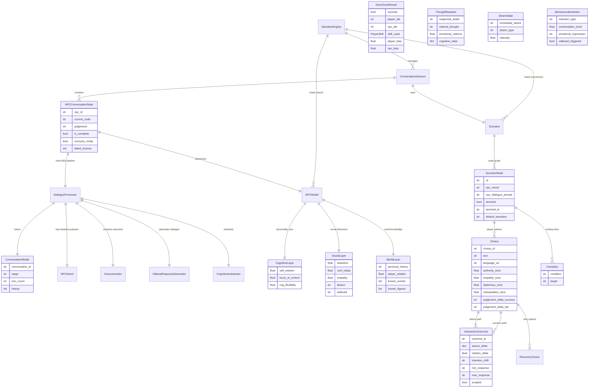
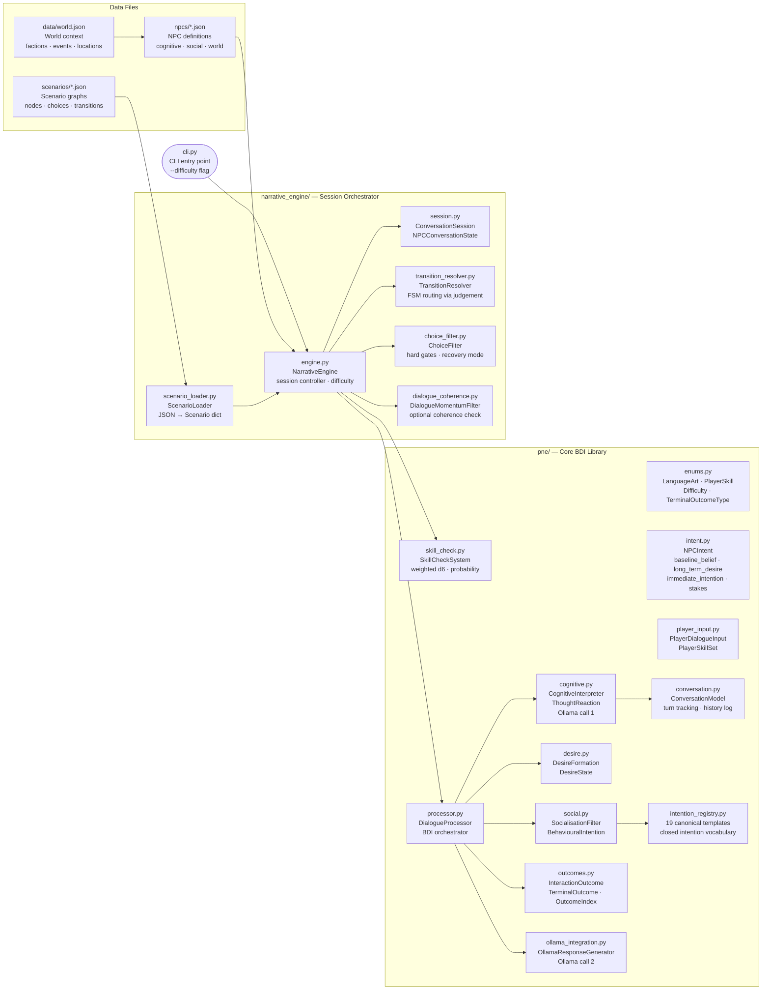

# Psychological Narrative Engine — Architecture Reference

> Render with the VS Code Mermaid Preview extension or paste into [mermaid.live](https://mermaid.live).

---

## 1. Per-Turn Data Flow

How a single player choice flows through the system to produce an NPC response and route to the next node.

```mermaid
flowchart TD
    A([Player selects choice]) --> B[NarrativeEngine.apply_choice]

    subgraph FILTER ["Choice Gating (engine.py)"]
        B --> C[ChoiceFilter\nSkill reqs · relation gates · prerequisites]
        C --> D[DialogueMomentumFilter\nOptional coherence check]
    end

    subgraph DICE ["Dice System (skill_check.py)"]
        D --> E[SkillCheckSystem.roll_dice\nWeighted d6 player vs d6 NPC]
        E --> E1{player_die ≥ npc_die?}
        E1 -- YES --> E2[check_success = True\njudgement += delta_success × risk]
        E1 -- NO  --> E3[check_success = False\njudgement += delta_fail × risk]
    end

    subgraph BDI ["BDI Pipeline (processor.py)"]
        E2 & E3 --> F[CognitiveInterpreter.interpret\nOllama: qwen2.5:3b\n→ ThoughtReaction\n  · subjective_belief\n  · emotional_valence]
        F --> G[DesireFormation.form_desire\nPattern match on belief text + NPC stats\n→ DesireState\n  · immediate_desire\n  · desire_type\n  · intensity]
        G --> H[SocialisationFilter.filter\nScore INTENTION_REGISTRY templates\n→ BehaviouralIntention\n  · intention_type\n  · confrontation_level\n  · wildcard_triggered]
        H --> I[Select InteractionOutcome\nSuccess path or Failure path]
        I --> J[Apply effects to NPCModel\nstance_delta · relation_delta\nintention_shift]
    end

    subgraph RESPONSE ["Response Generation (ollama_integration.py)"]
        J --> K[OllamaResponseGenerator\n.generate_response_with_direction\nOllama: llama3\nPrompt sections:\n  IDENTITY · WORLD CONTEXT\n  BDI STATE · ACTING NOTES\n  RESPONSE RANGE · HISTORY\n  SCENE DIRECTION · DICE CONTEXT]
        K --> L([NPC dialogue line ≤ 40 words])
    end

    subgraph FSM ["FSM Routing (transition_resolver.py)"]
        L --> M[TransitionResolver.resolve\nEvaluate: judgement · turn_count\n· intention_shift]
        M --> N{Terminal node?}
        N -- YES --> O[generate_terminal\nFinal NPC line\nOutcome: SUCCEED / FAIL / NEGOTIATE]
        N -- NO  --> P([Next scenario node])
    end
```



---

## 2. Entity Relationship

Data structures and how they relate to each other.



---

## 3. Module Map

Package layout with each module's responsibility.



---

## 4. Key Attribute Reference

| Layer | Fields | Scale |
|-------|--------|-------|
| Cognitive | `self_esteem`, `locus_of_control`, `cog_flexibility` | 0.0 – 1.0 |
| Social | `assertion`, `conf_indep`, `empathy` | 0.0 – 1.0 |
| World | `player_relation` | 0.0 (distrust) – 1.0 (trust) |
| Dice bias | `(skill / 10) + relation_bias + difficulty_adj` | 0.0 – 1.0 |
| FSM | `judgement` | 0 (fail) – 100 (succeed) |
| Difficulty adj | SIMPLE `+0.15` · STANDARD `0.00` · STRICT `−0.15` | additive bias |
| Emotional valence | negative ← −1.0 … +1.0 → positive | per-turn reaction |
| Confrontation | passive ← 0.0 … 1.0 → aggressive | `assertion × 0.7 + conf_indep × 0.3` |

---

## 5. Dice Probability Formula

```
player_bias  = clamp(player_skill / 10  +  relation_bias  +  difficulty_adj,  0, 1)
npc_bias     = calc_threshold(npc, skill)   ← derived from NPC attributes

P(face k) ∝ exp(bias × k)   for k = 1 … 6   (weighted d6)

success      = player_die >= npc_die
```

`relation_bias` = `(player_relation − 0.5) × 2 × (RELATION_CAP / 100)` where `RELATION_CAP = 10`
